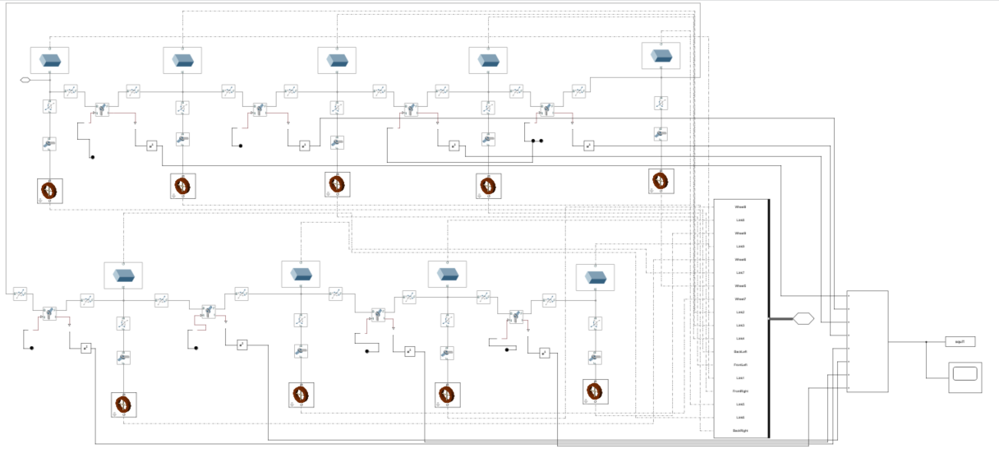
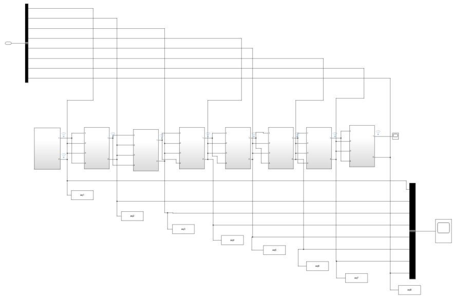
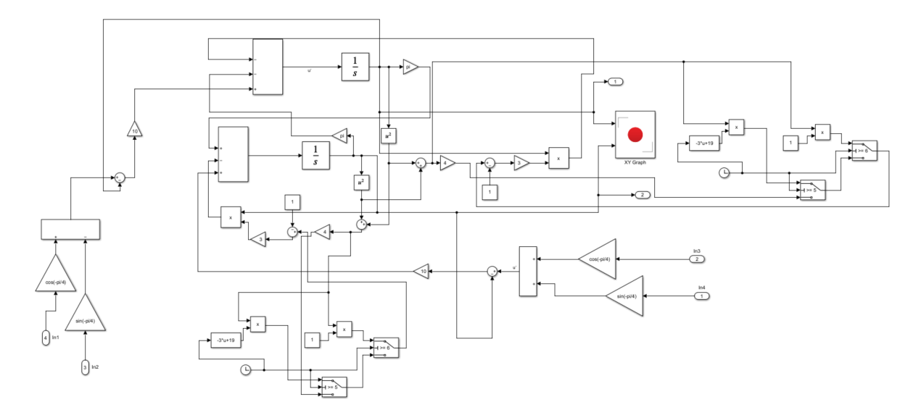
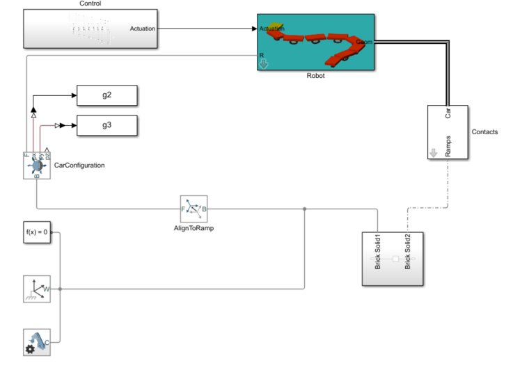

# Snake_robot_Multibody
Simulink and MATLAB Multibody models for snake-like robot locomotion with CPG control.
# Snake_robot_Multibody

Simulink and MATLAB Multibody models for snake-like robot locomotion with CPG control.  
中央パターン発生器 (CPG) を用いたヘビ型ロボットの運動モデル（Simulink & MATLAB Multibody）  
基于 Simulink 和 MATLAB Multibody 的蛇形机器人 CPG 控制建模与仿真

---

## 📌 Overview | 概要 | 项目简介
- **English**:  
  This repository focuses on the implementation of snake-like robot locomotion using Hopf Oscillator-based CPGs with linearly varying parameters.  
  The snake robot is modeled in **Simscape Multibody**, while the coupled Hopf Oscillators are implemented in **Simulink**.  
  To reduce joint torques, linear parameter variations are introduced into the Hopf Oscillators.  

- **日本語**:  
  本リポジトリは、線形パラメータ変化を持つ Hopf オシレーターに基づく CPG を用いたヘビ型ロボットの運動実現に焦点を当てています。  
  ヘビ型ロボットは **Simscape Multibody** でモデル化され、Hopf オシレーターの連鎖結合は **Simulink** で実装されています。  
  また、関節トルクを低減するために、Hopf オシレーターのパラメータを線形的に変化させています。  

- **中文**:  
  本仓库的研究重点是基于 **Hopf 振荡器** 的 CPG 控制，并引入**线性参数变化**以实现蛇形机器人运动。  
  蛇形机器人采用 **Simscape Multibody** 进行建模，单链耦合的 Hopf 振荡器通过 **Simulink** 实现。  
  同时，为了减少关节扭矩，对 Hopf 振荡器的参数进行了线性化调整。  

---

## 📂 Repository Structure | リポジトリ構成 | 仓库结构

---

## 🚀 How to Run | 実行方法 | 使用方法
- **English**  
  1. Open MATLAB (R2021b or later recommended).  
  2. Add the repository to MATLAB path.  
  3. Open the Simulink model in `/models`. Example:  
     ```matlab
     open('snake_multibody.slx')
     ```
  4. Run the simulation to reproduce locomotion results.  

- **日本語**  
  1. MATLAB を開く（推奨：R2021b 以降）。  
  2. リポジトリを MATLAB のパスに追加する。  
  3. `/models` フォルダ内の Simulink モデルを開く。例：  
     ```matlab
     open('snake_multibody.slx')
     ```
  4. シミュレーションを実行してロボットの運動を再現する。  

- **中文**  
  1. 打开 MATLAB（建议 R2021b 及以上版本）。  
  2. 将仓库路径添加到 MATLAB 路径。  
  3. 打开 `/models` 文件夹中的 Simulink 模型，例如：  
     ```matlab
     open('snake_multibody.slx')
     ```
  4. 运行仿真以复现运动结果。  

---

## 🖼 Model Diagrams | モデル図 | 模型示意图

### 1. Snake-like Robot Simscape Multibody Model  
蛇形机器人 Simscape Multibody 模型  
中央パターン発生器 (CPG) に基づくヘビ型ロボットの Simscape Multibody モデル  



---

### 2. Coupled Hopf Oscillators (Linear Topology)  
线性拓扑结构耦合的 Hopf 振荡器（作为 CPG 控制器）  
線形トポロジーで結合された Hopf オシレーター（CPG コントローラ）  



---

### 3. Single Hopf Oscillator in Simulink  
单个 Hopf 振荡器的 Simulink 模型  
単一 Hopf オシレーターの Simulink モデル  



---

### 4. Overall System Structure  
整体系统结构图（CPG 控制 + Simscape Multibody + 环境交互）  
全体システム構造図（CPG 制御 + Simscape Multibody + 環境相互作用）  



---

## 🛠 Dependencies | 依存関係 | 依赖环境
- MATLAB / Simulink  
- Simscape Multibody  
- (Optional) SolidWorks for CAD model import  

---

## 📖 Future Work | 今後の課題 | 后续工作
- Extension to multi-joint (N-link) models  
- PSO-based optimization of Hopf Oscillator parameters  
- Integration with real-time robot experiments  

- 多関節（Nリンク）モデルへの拡張  
- Hopf オシレーター パラメータの PSO 最適化  
- 実機ロボット実験への応用  

- 扩展至多关节（N 链节）模型  
- 基于 PSO 的 Hopf 振荡器参数优化  
- 与实际机器人实验的结合  
